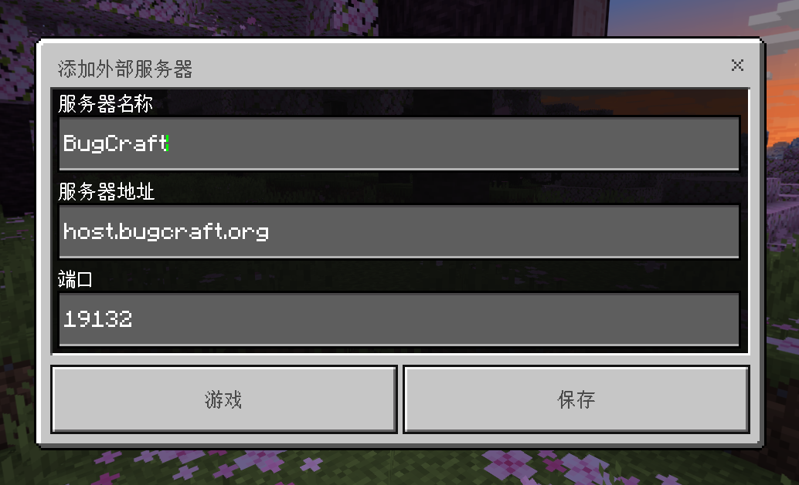

# Bedrock

Bedrock 版 Minecraft 适用于在 Android 和 Windows 设备（iOS 设备或许也可以）上加入 BugCraft。

!> Bedrock 版玩家的 BugID 会自动附加 `.` 前缀，这意味着 Bedrock 版 BugID 无法与 Java 或者 EaglerX 版 BugID 通用。如果你试图创建相同名称且具备 `.` 前缀的 Java 版本，或许可以连接至 Bedrock 版 BugID。但这可能会导致未知的错误，请谨慎操作。

## 第一步 | 运行客户端

?> 仅支持 1.19.80 - 1.20.0.1 版本，请注意你的 Bedrock 版 Minecraft 版本。

在此之前，你的设备必须已安装 Bedrock 版 Minecraft。如果你的设备未安装 Bedrock 版本 Minecraft 并且操作系统为 Windows 10 或 11，请前往微软商店并安装 Minecraft 的 Bedrock 版本。

如果你的设备的操作系统是 Android，则请前往[苦力怕论坛的网络硬盘账户](https://www.123pan.com/s/9HM9-SDzlA.html)下载 Minecraft 的 `.apk` 安装文件。

然后启动 Minecraft Bedrock 版。

## 第二步 | 填写服务器地址

BugCraft 的 Bedrock 版服务器地址是：

地址：

> host.bugcraft.org

端口：

> 19132

如果你不知道该怎么填写，按照下面的例子来填写即可。

然后点击保存即可。

## 第三步 | 加入游戏

点击保存，然后加入游戏。

这个时候，你便可以开始 BugCraft 之旅了。

## 第四步 | 后续步骤

接下来，进行一些后续步骤，例如注册或登录 BugID。
