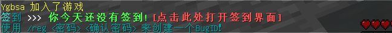

# BugID

什么是 BugID 呢？其实就是你用来加入 BugCraft 的账户啦。

在这个章节的前三篇文档中，我们已经详细地了解过如何加入 BugCraft 了！而在这三篇文档中，都提到了“后续步骤”。这后续步骤就包括创建和登录 BugID！

## 判断是否已注册

观察进入 BugCraft 后，你的聊天栏里面有些什么。

### 未注册状态

没有注册的话，你的聊天栏将会出现这样的提示（可能会随着 BugCraft 的更新而变化）。这个时候，输入 `/reg <密码> <确认密码>` 就可以注册了！

!> 不要真的输入 `/reg <密码> <确认密码>` 哦！这只是一种占位符而已。举个例子，如果你的密码是 `114514`，则使用 `/reg 114514 114514` 来注册！

在下一次连接到 BugCraft 时，使用相同的 BugID 并登录！

### 已注册状态

如果出现这种提示，可以辨认一下这是不是你的 BugID 名称。如果你是第一次加入，或者这不是你的 BugID 名称，请更换 BugID 名称，毕竟这个名称已被占用了。

?> 如果你使用 Bedrock 版 Minecraft 加入，则一般不会出现 BugID 已被占用这种情况。

如果这是你的 BugID，请使用 `/l <密码>` 登录。

!> 不要真的输入 `/l <密码>` 哦！这只是一种占位符而已。~~为什么这句话如此熟悉？~~举个例子，如果你的密码是 `114514`，则使用 `/l 114514` 来登录！

## 开始游玩

很好！记住一定要记住密码！

然后你就可以开始玩了！
