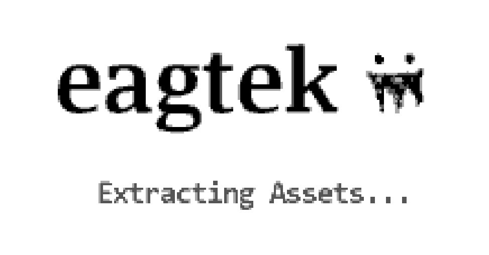
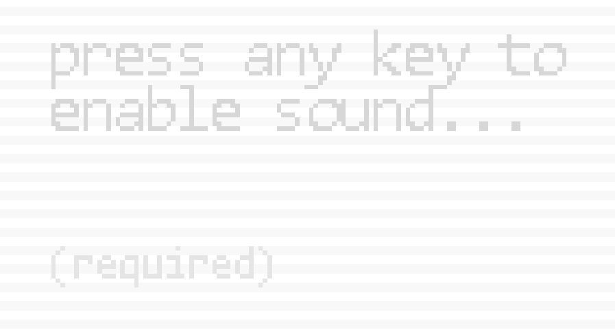
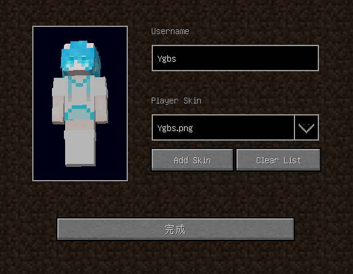
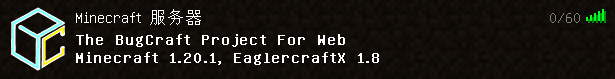

# EaglerX

EaglerX 是 EaglercraftX 的缩写，这是一种可以让你在支持 WebGL 2.0 的浏览器中游玩 Minecraft 的技术。

BugCraft 通过搭载 EaglercraftXBungee 插件来实现对于 EaglerX 的支持。所以你可以在浏览器中直接游玩 BugCraft。需要注意的是，EaglerX 要求浏览器具备 WebGL 2.0 功能，并且要求能够定位鼠标光标位置以实现视角转动。

如果你的浏览器在启动 EaglerX 时遇到问题，请使用其它种类的客户端。以下是使用 EaglerX 加入 BugCraft 的方法。

## 第一步 | 打开客户端列表

BugCraft 的 EaglerX 客户端列表位于：

> http://host.bugcraft.org:18000/

这在我们的官方网站上也有所提及。

!> 不要使用 Java 版或者 Bedrock 版来连接这个地址！曾经有一个玩家这样做了，然后那位玩家的客户端便显示出了“连接已重置”。请使用浏览器打开，正常来说你可以直接点击这个链接来跳转。

## 第二步 | 挑选客户端

客户端列表中会显示出所有可用的客户端。每个客户端都对应着一个链接，下方写明了该客户端的特点。点击链接以进行跳转。

## 第三步 | 启动客户端

在跳转之后，你的浏览器会从 BugCraft 的 HTTP 服务器下载客户端所需的文件并解压缩以备使用。随后，EaglerX 的代码将会开始执行。

如果一切顺利，你可以看到这副画面：

此时的 EaglerX 正在加载，就如同一个普通的 Minecraft 1.8 客户端一样。

之后，你将会看到另一番景象。

这个时候，使用鼠标点击画面内的任意位置，即可令客户端继续加载。此外，图片中文字的意思是“按下任意按键以启用音频（必需的）”。

再稍等一会，客户端便会加载完成。

## 第四步 | 调整设置

在启动完毕后，你会被带到这个页面来。

这里的提示文字可能因客户端版本而异。不过页面大体上是相同的。下文中提到的提示文本（例如“Username”）只要位置相同，那么操作步骤便也是一样的。

将“Username”改为一个你喜欢的名字。**不建议使用默认用户名**，因为那样不便于 BugCraft 内的其他玩家认识你。

?> 如果你有 Java 版的 BugID，则可以通过输入相同的名字来使用相同的 BugID。背包内的物品、领地权限等是通用的。

你还可以设置皮肤。点按笑脸图标可以从现有的皮肤中选择一个。或者你也可以从本地导入皮肤（点按“Add Skin”即可）以使用。

!> 在这里设置的皮肤只是客户端效果！如果你需要设置其他玩家可见的皮肤，请使用 `/skin` 命令。

## 第五步 | 进入主界面

点按“完成”即可进入 EaglerX 的主界面。

效果如“快速开始”章节的封面所示。

接下来点按“多人游戏”按钮。

## 第六步 | 加入游戏

你将可以看见这个条目（文本内容可能会随 BugCraft 的更新而改变）。双击即可加入 BugCraft！

## 第七步 | 后续步骤

接下来，你可以注册或登录 BugID，或者进行其它操作。

请参见其它章节。
