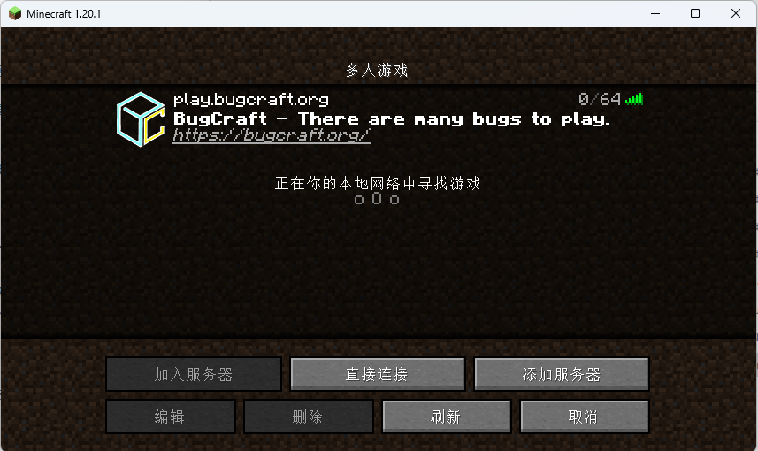
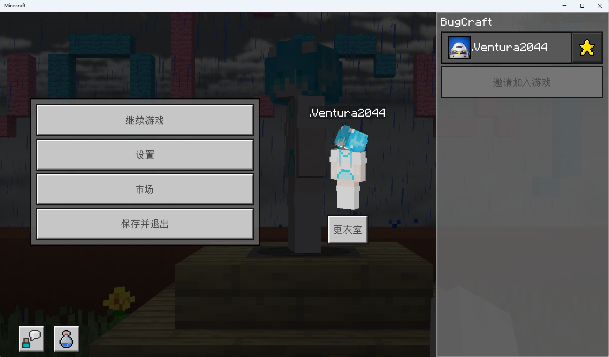
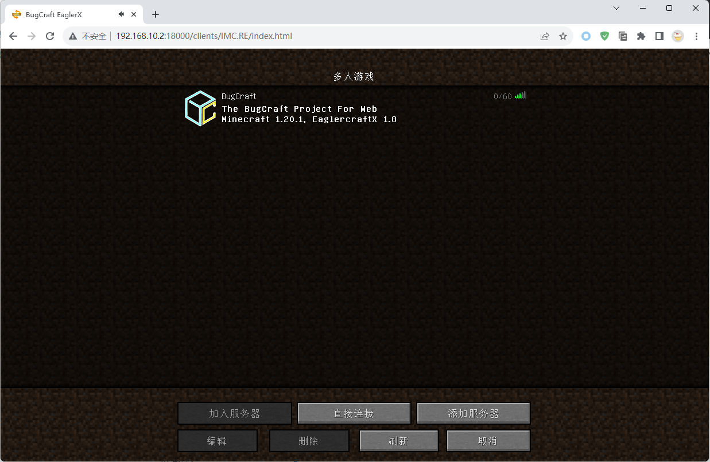

# 安装客户端

## Java 版本

关于如何安装 Java 版本的客户端呢，在互联网上已有很多教程了！在这里，我们推荐你使用 [Hello Minecraft! Launcher](https://hmcl.net/) 来启动 Java 的版本的 Minecraft 客户端。

那么，要怎么找到安装教程呢？你可以[进行搜索](https://bing.com/search?q=Java+%E7%89%88%E6%9C%AC+Minecraft+%E5%AE%89%E8%A3%85%E6%95%99%E7%A8%8B)并找到一篇适用于 HMCL 的教程。然后，跟着它的指引来操作就好了！

!> 不要下载错 Minecraft Java 版的版本了！我们只能支持 https://bugcraft.org/ 所列举的版本……

## Bedrock 版本

你需要获取一份 Minecraft 安装程序包。对于 Windows 操作系统，你应该获取一个符合版本要求（在 https://bugcraft.org/ 中有描述到）的 `.appx` 安装程序包。对于 Android 操作系统，你需要获取一个符合版本要求的 `.apk` 安装程序包。然后安装它们。

对于 iOS 或者 iPadOS 上的 Minecraft Bedrock 版本，我们无能为力。但是你依然可以通过参考 [Craft233 的文档](https://www.craft233.top/Install_game/iOS_iPadOS.html)来安装它。

在安装完成后，请一定要注册、登录 XBox 账户，这是加入服务器所必须的。

## EaglerX 版本

这要求你具有一个支持 WebGL 2.0 的浏览器。我们推荐你使用 [Chrome](https://www.google.cn/chrome/index.html) 来启动 EaglerX！同时，这也是这个章节（“安装客户端”章节）中的封面中的客户端。如你所见，它不需要下载即可游玩。

在 https://bugcraft.org/ 找到我们的 EaglerX 站点。打开 EaglerX 网页后，不停点击屏幕直到进入主页面。

我想，这也算是安装客户端了吧。因此，这个部分被划分到“安装客户端”章节。
