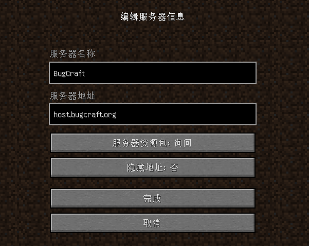

# Java

~~Java 是一种咖啡，喝起来不知道好不好喝。~~

Java 版 Minecraft 是加入 BugCraft 的最好办法！借助 1.8 - 1.20 的 Java 版 Minecraft，你可以很方便地加入 BugCraft！

如果你的设备不能运行 Java 版 Minecraft 或者运行它时较为卡顿，则可以考虑使用 Bedrock 或者 EaglerX 版本。

以下是使用 Java 版 Minecraft 是加入 BugCraft 的详细步骤。

## 第一步 | 运行客户端

这要求你具备一定的 Minecraft 基础知识。如果你不知道如何运行或者安装 Java 版 Minecraft，请使用 EaglerX 版或者参考一下[来自 Bing 的搜索结果](https://cn.bing.com/search?q=Java+%E7%89%88+Minecraft+%E5%AE%89%E8%A3%85%E6%95%99%E7%A8%8B)。

如果你可以运行 Java 版本客户端，则请先启动它。

## 第二步 | 填写服务器地址

点按多人游戏，填写服务器地址。BugCraft 的 Java 版服务器地址是：

> host.bugcraft.org

如果你不知道如何填写服务器地址，那么按照下图中的样子来填写。

点按“完成”，然后加入这台已添加的服务器吧！

## 第三步 | 后续步骤

接下来，你可以进行一些其它步骤，例如创建和登录 BugID 等。
