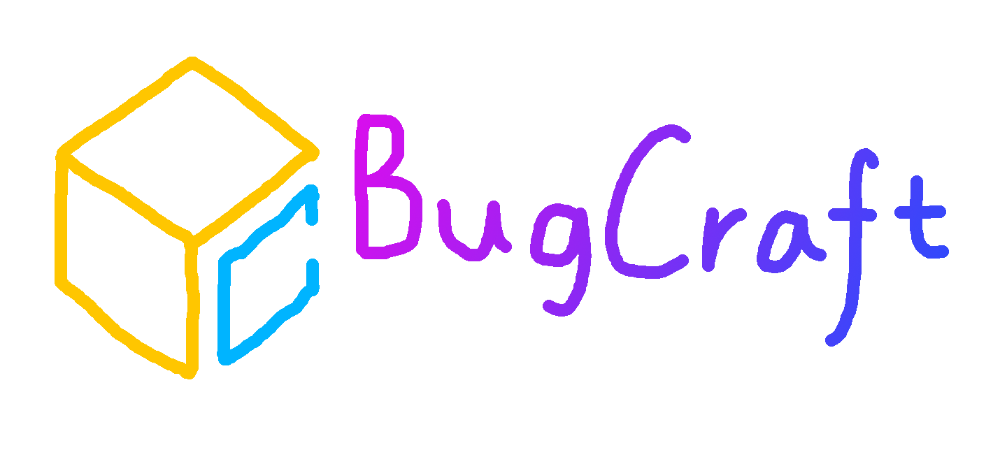

# BugCraft Docs

欢迎查看 BugCraft Docs！这里是 BugCraft 的文档。在这里，你可以查看一些关于 BugCraft 的教程哦。那么，应该怎么做呢？点击左边的条目即可查看不同的章节与条目。如果你需要查找某些内容，使用左上角的输入框。点击搜索框下方的大标题可以返回这里。左下角的汉堡图标可以折叠侧边栏以便你更好地阅读哦。

好的，那么，如果你已经准备就绪了，那么就开始阅读吧！如果你需要使用本地的 Markdown 阅读器进行阅读，或者你希望修改文档并向我们提交修改，请前往此文档网站的 [GitHub 存储库](https://github.com/Bug-Craft/Docs/)，或者直接[下载此文档网站的压缩包](https://github.com/Bug-Craft/Docs/archive/refs/heads/main.zip)吧！

你可以随便地分发这一份文档，或者与其他人分享。但是在分发、转载时，你需要注明此文档来自 `docs.bugcraft.org`，否则我们会很难过的哦……毕竟这是我们写了好久的嘛……

BugCraft Docs 是使用 [Docsify](https://docsify.js.org/) 编写的。这是一款十分好用的工具！
